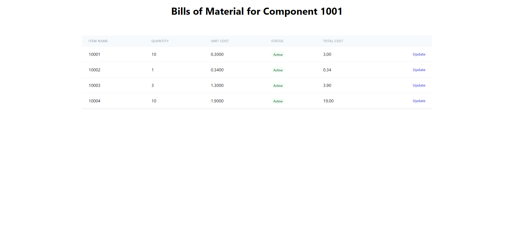

# BOM List

This Application shows the mock data of bills of material

## Live Demo

[View Live Demo]()

## Screenshots

## Features & Usage

- A table of the mock data.
- You can see the mock response from api in the table
- To update the Quantity you have to click on the update button which will take you to product page.

- You can navigate back to the home page by clicking on the Home button
- The Update functionality of this application only work when the server is in local domain

## Setup

1. Clone this repository and access the project's directory.
2. Run `yarn install`.

3. Run `yarn start` to work on the development server.

## Built With

- JavaScript/ES6

- React
- React Hooks
- React Router
- Tailwind CSS
- [Json typeholder](https://jsonplaceholder.typicode.com/) for fake API Calls
- Netlify

## Author

👤 **Shubham Singh**

- Github: [@shubhsk88](https://github.com/shubhsk88)
- Twitter: [@shubhski](twitter.com/shubski)
- Linkedin: [linkedin](https://www.linkedin.com/in/shubhski/)

## 🤝 Contributing

Contributions, issues and feature requests are welcome!

## Show your support

Give a ⭐️ if you like this project!
